# MinIO Quickstart Guide - vSphere 8 Supervisor Service

---

From the Berger Menu Select Workload Management

---

In Workload Management Select Services

Click **ADD** under Add new Service
---

Click the URL Discover and download available Supervisor Services here.
---

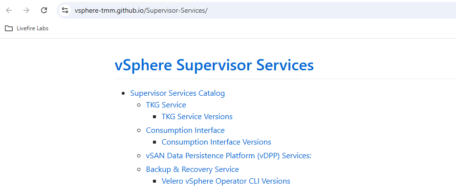

Click the **URL** vSAN Data Persistance Platform (vDPP) Services:
---

Click the **URL** for Downlod version: Minio 2.0.10 to download the deployment yaml for the Minio Service.
---

Go back to vCenter and click Upload, select the downloaded minio yaml file
---

Click **NEXT**

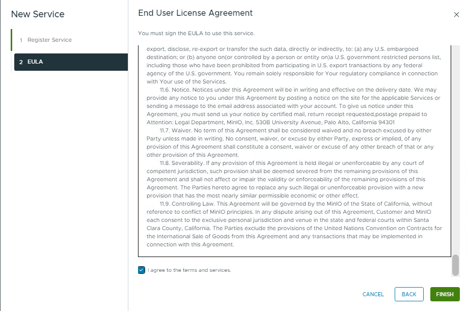

Accept the **EULA**

Click **FINISH**
---

Once the Service is deployed to vSphere it needs to added to the Supervisor

Click **ACTIONS** under Minio

Select Manage Service
---

Select your Superviser

Click **NEXT**
---

No Values file for Minio

Click **FINISH**
---
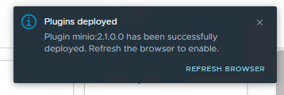

Wait for the Minio Plugin install task to finish
---

In Workload management slect the **Supervisor --> Configure --> Minio --> General** to confirm that the Service is up and you can get to the vCenter plugin
---

Click in **Minio --> Tenant --> ADD**
---

Give the Tenant a Name (MetaData)

Enter the vSphere Supervisor Namespace you wish to assign this Tenant to (must match)

Choose the storage class assigned to the Namespace you wish to use for tenant Storage

Click **NEXT**
---
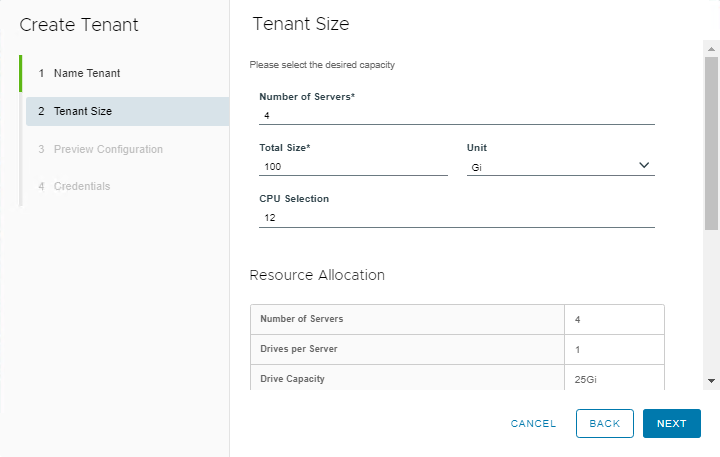

Configure the Tenant Server size
---
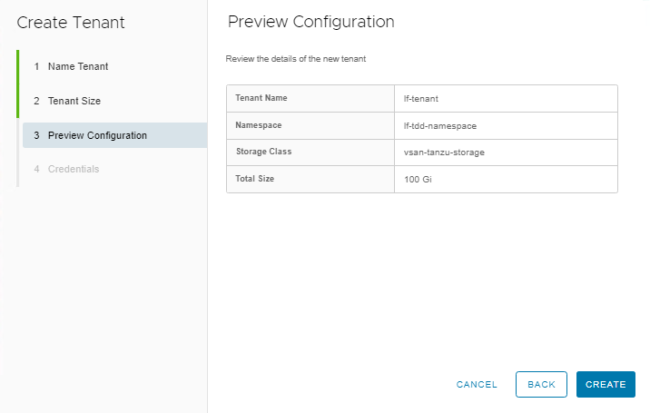

Preview your entries

Click **CREATE**
---
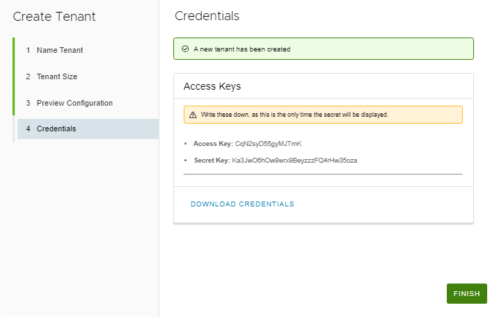

Make Sure you Download the credentials file. You will not be shown this info again.

Click **FINISH**
---
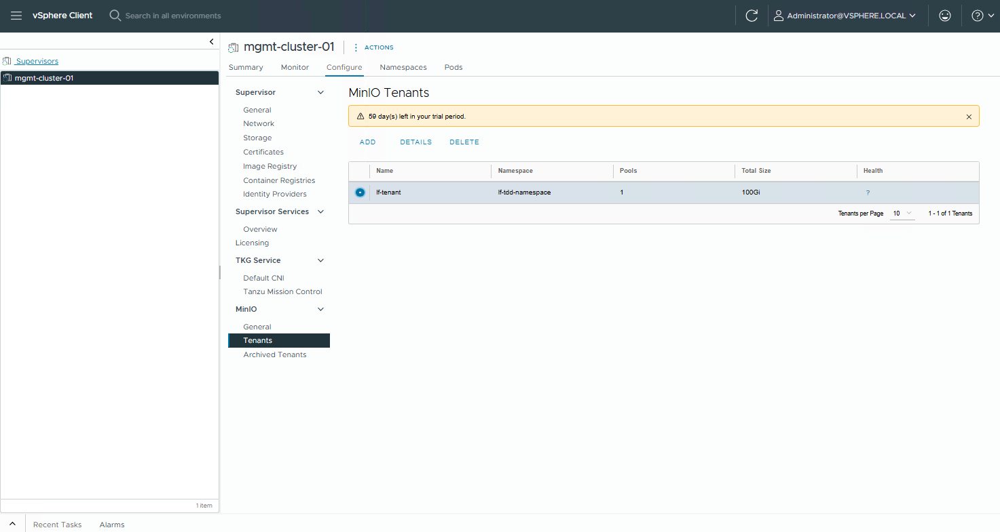

Select the new Tenant click **DETAILS**

---
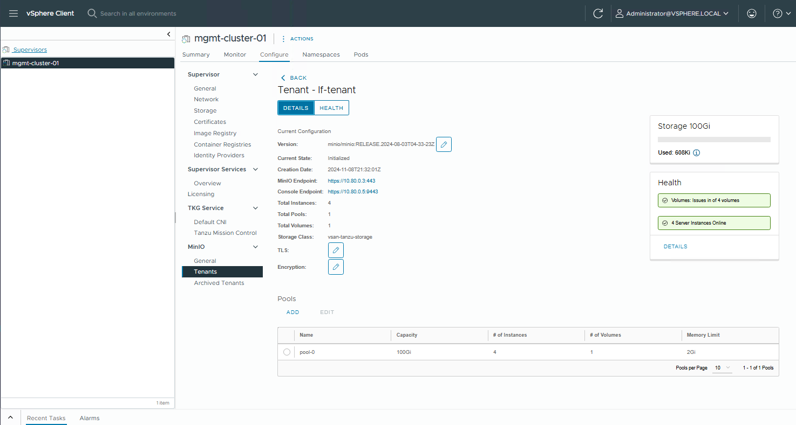

Click **HEALTH**

---
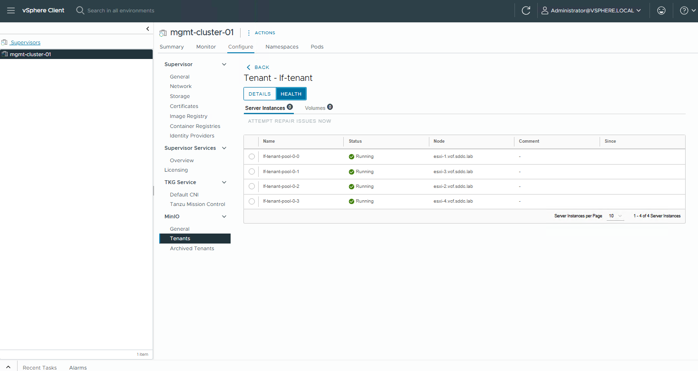

Once the Tenant is up and Running click back to **DETAILS**

---

Click the **Console Endpoint URL**

---
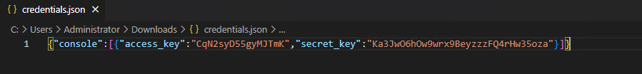

Find the crentials.json file you downloaded earlier

For Login into the Console "access_key" = **UserID** and "secret_key" = **Password**

---
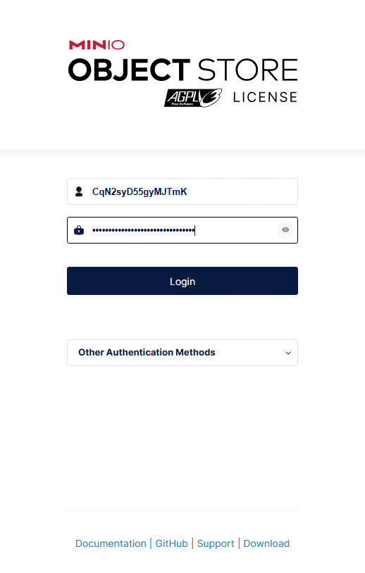

**Login**

---
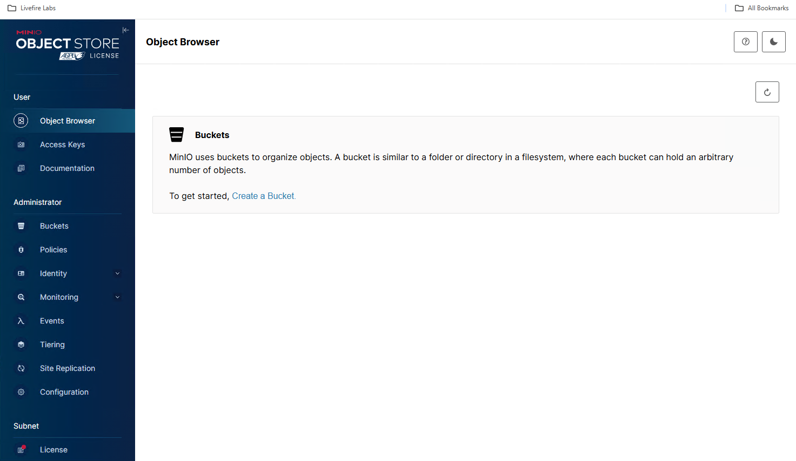

You are ready to administer the tenant.
